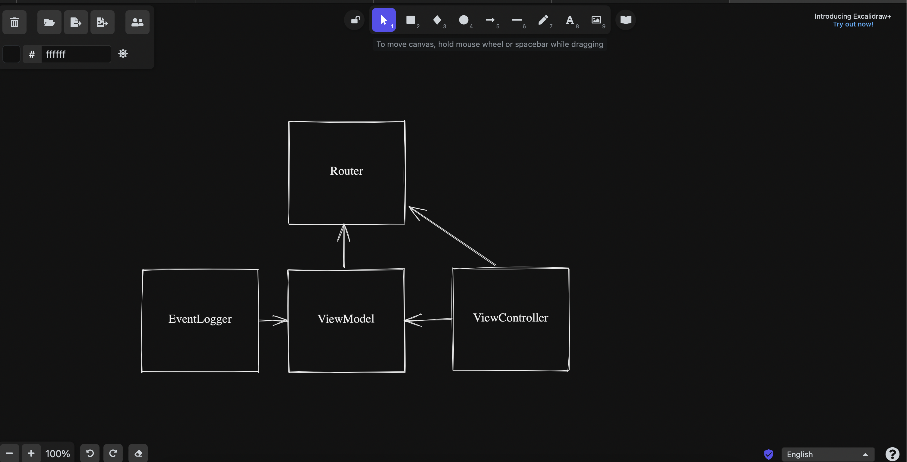

# Mobius 2022 spring
### [Navigating the iOS Interview](https://www.raywenderlich.com/10625296-navigating-the-ios-interview)

## Резюме
### [iOS Developer Resume Examples](https://www.raywenderlich.com/2617-ios-developer-resume-examples)

## Сопроводительное письмо
### [Пиши, сокращай: Как создавать сильные тексты | Сарычева Людмила, Ильяхов Максим](https://www.ozon.ru/product/pishi-sokrashchay-kak-sozdavat-silnye-teksty-sarycheva-lyudmila-ilyahov-maksim-241182327/?sh=3gKP97ZF4g)

## Техническое интервью
## Алгоритмическая секция
### [Swift Algorithm Club](https://github.com/raywenderlich/swift-algorithm-club)
Here you'll find implementations of popular algorithms and data structures in everyone's favorite new language Swift, with detailed explanations of how they work.

### [Practice programming interview questions](https://www.interviewcake.com)

## Архитектурная секция
### [Framework For Mobile System Design Interviews](https://github.com/weeeBox/mobile-system-design)

### [Online whiteboard](https://excalidraw.com)

